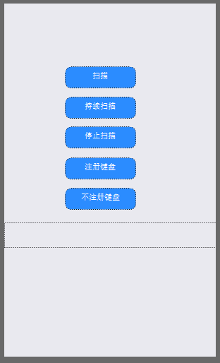

## R100扫描插件
#### 插件说明：
可使用R100扫描设备，进行条码扫描

#### 方法：
|方法|方法说明|
|:-|:-| 
|BarcodeScan（time）  | 扫描条码。BarcodeIsMulti设置false: 取值 (1-600), 代表几秒后自动关闭, 默认 2。BarcodeIsMulti设置true: 取值(2-50), 代表连续扫描间隔, 默认 2|
|BarcodeIsMulti（isMulti）  | 是否开启连续扫描，true为开启，false为关闭（默认）|
|BarcodeScanStop  |停止扫描。在持续扫描条码时，调用后停止持续扫描|
|EnableTrigger  |启用扫描键(默认)|
|DisableTrigger  |禁用扫描键|
|BindKeyDown  |扫描键功能自定义|
|UnBindKeyDown  |扫描键功能不自定义(默认)|

#### 事件：
|事件|事件发生条件|
|:-|:-|
|BarcodeDataCaptured|条码扫描后发生|
|OnNotify|在方法调用返回通知时发生（仅在出现错误时触发）|
|KeyDown|按键后发生|

#### 插件使用：
### 一.插件打包

使用R100扫描插件需要先在云平台上打包。

打包完后安装app，在打包期间可以进行下一步操作。

### 二.Dll引用

在项目中引用R100的Dll

### 三.插件使用

在设计器中添加R100组件

并添加你所需的smobiler控件，例如下图

接下来调用你所需的方法即可。

###### 调用Barcode扫描：
    C#:
    //调用Barcode扫描
     private void btnScan_Press(object sender, EventArgs e)
     {
         this.r100Scanner1.BarcodeIsMulti(false);
         this.r100Scanner1.BarcodeScan();
     }
###### 条码扫描后接收事件中的信息：
    C#:
    //接收事件中信息
    private void r100Scanner1_DataCaptured(object sender, R100BarcodeScanEventArgs e)
    {
         this.labData.Text = e.Data;
    }

### 四.源代码地址

